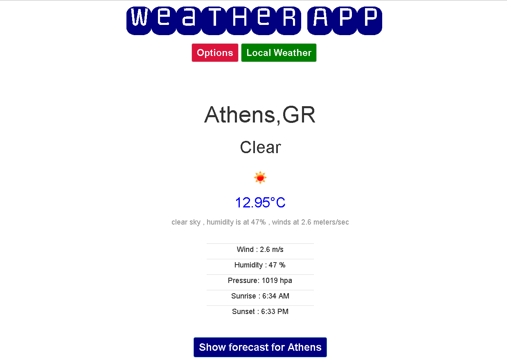

# Open-Weather-Map-Angular-App

An angular app that uses the open weather map api
 This is a simple application made for exploring Angular and Git.
 This app is using Angular Seed . https://github.com/angular/angular-seed.git

## How to use it:
 1) Git clone https://github.com/Cyb3rN4u7/Open-Weather-Map-Angular-App.git
 2) <a href='https://nodejs.org/' target ='blank_'>Install Node.js</a>
 3) In the folder run  npm install
 4) Run npm run

And you are ready to use the app

