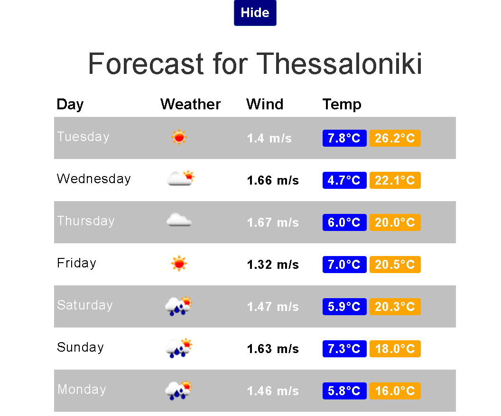

# Open Weather Map Angular App

An angular app that uses the open weather map api
* This is a simple application made for exploring Angular and Git.
* This app is using Angular Seed . https://github.com/angular/angular-seed.git
* And the <a href='https://ngmap.github.io/' target='blank_'> The angularjs-google-maps</a>

## How to use it:
 * <a href='https://nodejs.org/' target ='blank_'>Install Node.js </a>
 * In index.html add before </body> tag 
 ```
 <script src="http://maps.google.com/maps/api/js?key=sdfgfdsgfdgdfgdfg"></script> 
 ```
 * with key=your_google_maps_api_KEY
 * inside app/js/app.js you will put your open weather map api key 
```
        
  .factory('openWeatherApi', ['$http', function openWeatherApiFactory($http) {
        var apiUrl = 'http://api.openweathermap.org/data/2.5/weather?';
        var apiForecastUrl = 'http://api.openweathermap.org/data/2.5/forecast/daily?';
        // put here your open weather map api key ex: &APPID=jdjjfdkfkdkf94857489574
        var apiKey = '';
       

```
 


```
 git clone https://github.com/Cyb3rN4u7/Open-Weather-Map-Angular-App.git [my-app-name]
 cd [my-app-name]
 npm install
 npm start
```


And you are ready to use the app



